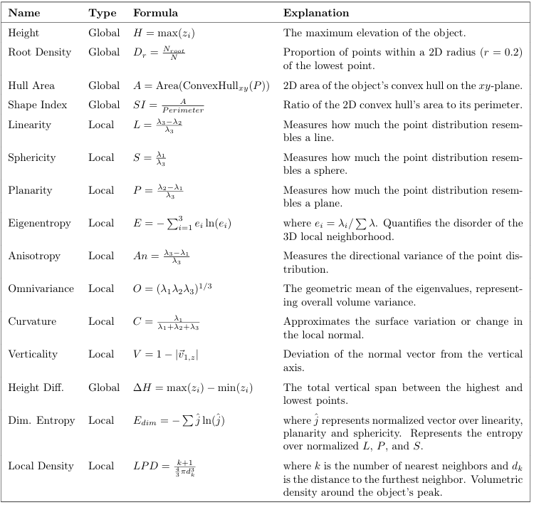

# Airborne classification of LiDAR data

# Contributors
- Darius-Eduard Floroiu 
- Belina Aileen Santoso 
- Tejas Ameya Ziegler 

| Feature Design | Classification Results |
|:--------------:|:----------------------:|
|  | <img src="img/SVM_RF.png" width="450n. | Performance comparison of SVM and Random Forest models. |
``

# Project Description

Point cloud classification is a fundamental task in 3D semantic labeling to enable meaningful interpretation of spatial data by assigning objects to semantic categories. This project focuses on the supervised classification of pre-segmented urban objects represented as point clouds (.xyz). Classification models, including Support Vector Machines (SVM) and Random Forests, are trained to categorize individual object point clouds into classes.

A key component of the project is feature engineering. A set of geometric features is designed and selected based on concepts and methodologies proposed in previous studies. The relevant literature and references are provided in the report (however, this report is kept private to safeguard course assignments and institutional privacy, for further questions, ask the repository owner)

To evaluate the project's effectiveness of the proposed features, Fisher's Criterion is used as a measure of class separability. For each feature, a separability score (*J-score*) is computed using the within-class scatter matrix and the between-class scatter matrix. Higher ratio obtained imply high variance between different classes while maintaining low variance within the same class. The 4 features yielding highest J scores are the most effective features. 

## Repository Structure

```text
├── A2-starter-code/        # Main source code
├── img/
│   ├── featuredesigns.png  # Illustration of extracted feature designs
│   └── SVM_RF.png          # SVM and Random Forest classification results
└── pointclouds-500.zip     # Dataset containing 500 segmented urban point clouds
```

### pointclouds-500.zip (File format): 
Each 'xyz' file contains the point cloud of a single object, in which each line has three floating point numbers denoting the x, y, and z coordinates of a 3D point.

Ground truth labels:
- 000 - 099: building
- 100 - 199: car
- 200 - 299: fence
- 300 - 399: pole
- 400 - 499: tree

### Credit and references:
The project is based off the 
All point clouds are taken from the DALES Objects dataset. More details about the dataset can be found in the following paper:
Singer et al. DALES Objects: A Large Scale Benchmark Dataset for Instance Segmentation in Aerial Lidar, 2021.
